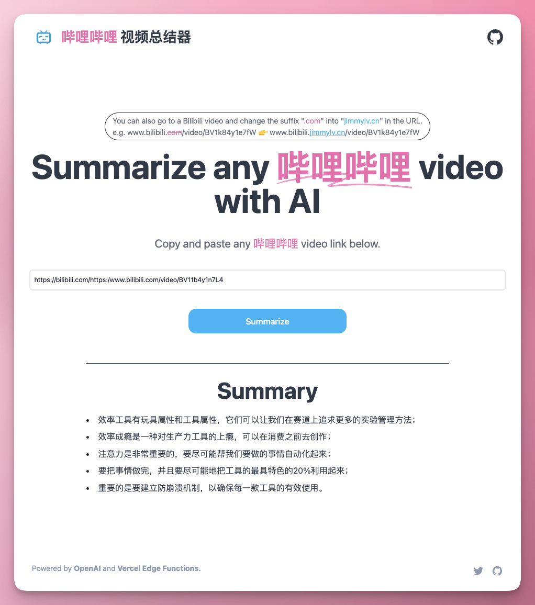

# [TechCrunchSummary.com](https://www.techcrunchsummary.com/)

This project summarizes TechCrunch articles for you using AI.

[](https://www.techcrunchsummary.com)

## How it works

This project uses the [OpenAI GPT-3 API](https://openai.com/api/) (specifically, text-davinci-003) and [Vercel Edge functions](https://vercel.com/features/edge-functions) with streaming. It fetches the content on a Techcrunch article, sends it in a prompt to the GPT-3 API to summarize it via a Vercel Edge function, then streams the response back to the application.

Video coming soon on how I built it from scratch!

## Saving costs

Projects like this can get expensive so in order to save costs if you want to make your own version and share it publicly, I recommend three things:

1. Implement rate limiting so people can't abuse your site
2. Implement caching to avoid expensive AI re-generations
3. Use `text-curie-001` instead of `text-dacinci-003` in the `summarize` edge function

I'm going to be implementing 1 & 2 for this repo very soon so keep an eye out on that!

## Running Locally

After cloning the repo, go to [OpenAI](https://beta.openai.com/account/api-keys) to make an account and put your API key in a file called `.env`.

Then, run the application in the command line and it will be available at `http://localhost:3000`.

```bash
npm run dev
```

## One-Click Deploy

Deploy the example using [Vercel](https://vercel.com?utm_source=github&utm_medium=readme&utm_campaign=vercel-examples):

[](https://vercel.com/new/clone?repository-url=https://github.com/Nutlope/news-summarizer&env=OPENAI_API_KEY&project-name=techcrunch-summarizer&repo-name=news-summarizer)
