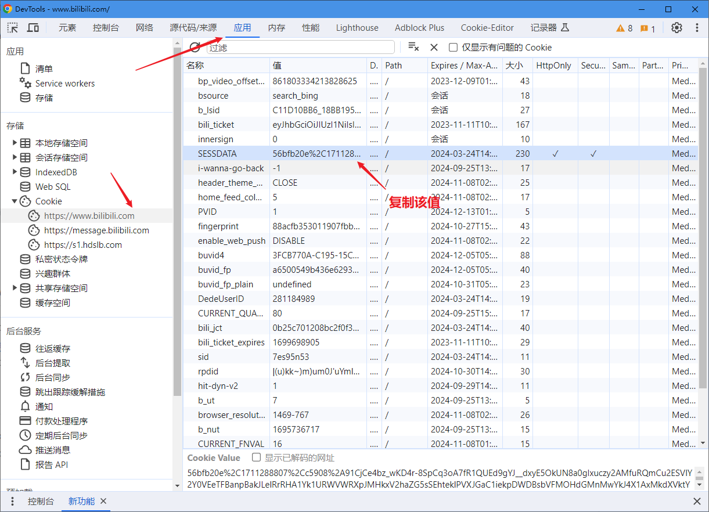
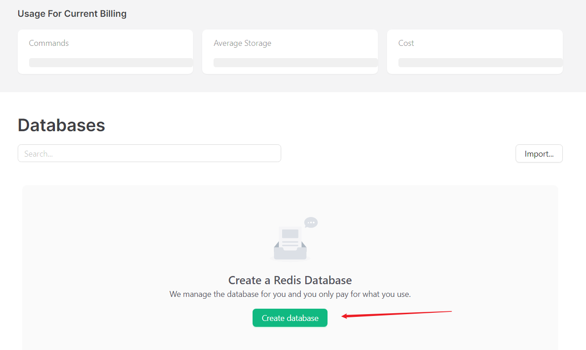
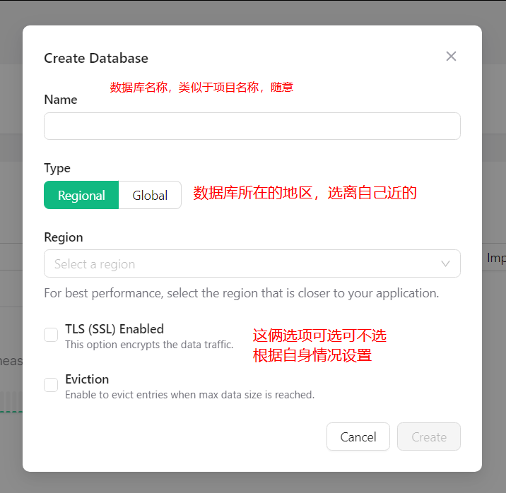

## 环境要求

nodejs 18.0 +

## 操作指引

1. clone 本仓库
2. 运行 `npm install`
3. 复制 [.example.env](.example.env) 到同级目录，并将其改名为 `.env`
4. 填写 `.env` 文件中所有的必填项 （也就是除了 Optional 下的所有内容）
   1. 在 https://platform.openai.com/account/api-keys 生成 key，复制它并赋值到 OPENAI_API_KEY
   2. 在 https://www.bilibili.com 中使用 F12 打开开发者控制台，导航至 application -> Cookies -> ...www.bilibili.com -> **SESSDATA**，复制该值并赋值到 `BILIBILI_SESSION_TOKEN`
      
   3. 在 https://savesubs.com 中使用 F12 打开开发者控制台，导航至 application -> Cookies -> ...savesubs.com -> **cf_clearance**，复制该值并赋值到 `SAVESUBS_X_AUTH_TOKEN`
   4. 登录 https://upstash.com，在 `Create a Redis Database` 页下点击 `Create database`
      
      根据情况输入基本信息:
      
      进入该数据库的控制台，下滑到 `REST API` 栏，点击复制`UPSTASH_REDIS_REST_URL`和 `UPSTASH_REDIS_REST_TOKEN`，赋值到同名变量
      
   5. 登录 https://supabase.com/ ，新建一个 project
      
      确认后，点击右侧导航的齿轮进入设置，复制 `URL` 到 `SUPABASE_HOSTNAME`，复制 `key` 到 `NEXT_PUBLIC_SUPABASE_ANON_KEY`。
      
5. 使用 `#` 注释掉 Optional 下的所有项 （可选）
6. 运行 `npm run dev`
